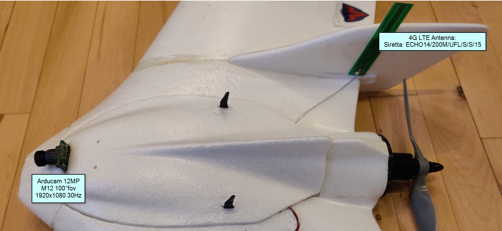
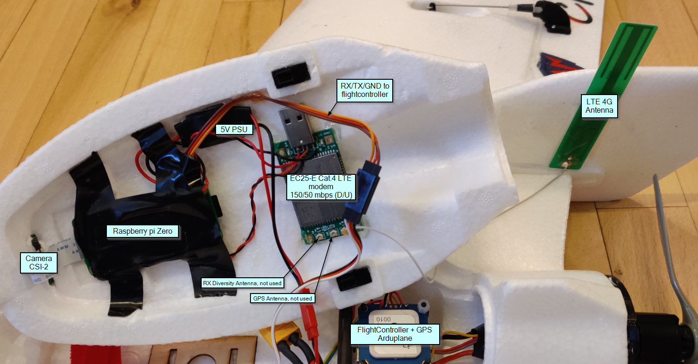
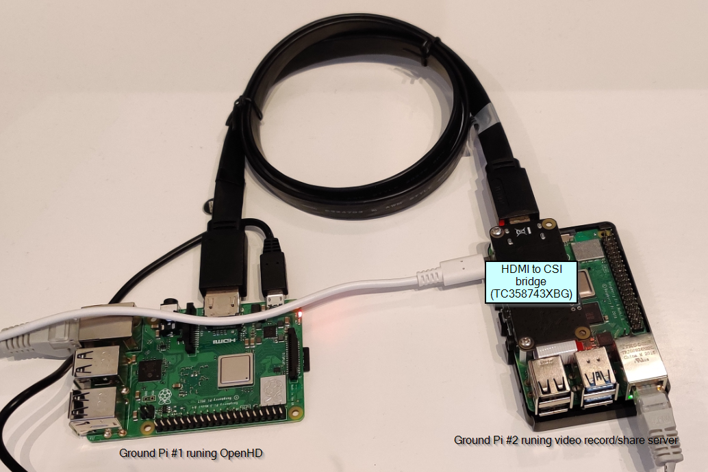
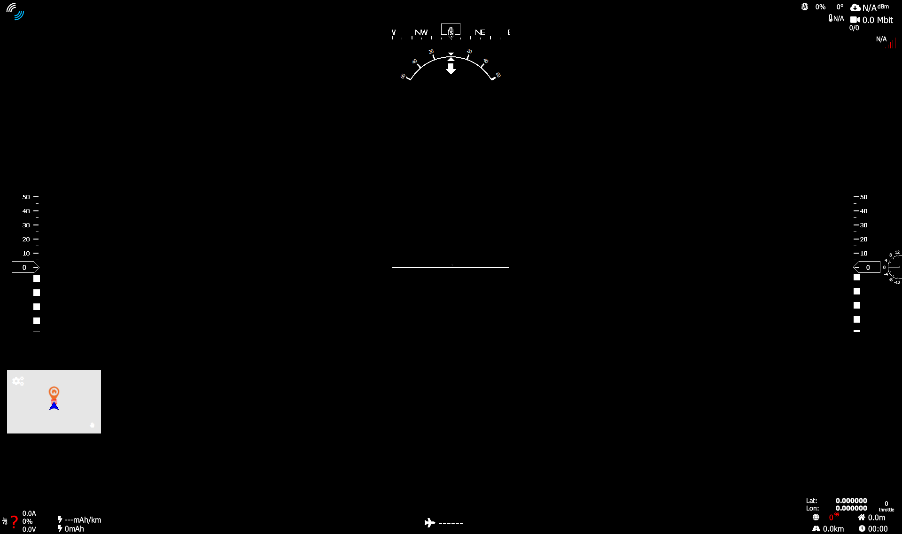

# Mavlink Ardupilot Telemetry and HD video via LTE (4G):

# Introduction
This is based on my project [MavlinkGPRS](https://github.com/KenLagoni/MavlinkGPRS) flying with 2G telemetry link, but this time I want to ad HD video streaming also and thus stepping up to 4G (LTE).

# Goals:
- Video and Telemetry data must be merged on the dronside , giving highest priority to the telemetry and then only transmit video if there is spare bandwidth.
- The drone must use a small/low power/cheap hardware platform like the Raspberry pi Zero for all data and video.
- All video must be recorded on the drone.
- The Groundstation must be able to share telemtry via the MavlinkServer from my [MavlinkGPRS](https://github.com/KenLagoni/MavlinkGPRS).
- The Groundstation must be able to share the videostream with OSD via TCP RTSP protocol.

# Hardware (Drone side):
This is the list of the setup im currently working on:

#### The LTE (4G) modem:
In order to get the highest bandwidt possible with LTE, a Cat. 4 modem (150Mbps/50Mbps Down/Up) must be used. This gives a maximum max upload of 50mbps and depending on the video settings, a maximum of ~10Mbps should do.
Currently I use the Quectel EC25-E because i live in the EU. These can be found on Aliexpress for around ~$50 in a fairly small formfactor where I can use my own external antenna.
{.center}

#### Raspberry Pi Zero:
Currently testing with Raspberry Pi Zero, and by using the CSI-2 interface and onboard HW video encoder I get 1920x1080 30fps without any problems. The total CPU usages is arround 20-30% inkl. the program which handles data transmission.
The Pi uses the lates Buster image with this program installed.

#### The camera:
Well the standard Raspberry Pi camera v1 and v2 are not very good, but they can be used. I currently use a [Arducam B0262](https://www.arducam.com/product/arducam-12mp-imx477-mini-high-quality-camera-module-for-raspberry-pi/) it is the same image sensor IMX477 as the new raspberry pi HQ camera, but the formfactor is smaller (same as RPI CAM v1/v2) and more importantant, the Lens can be swapped for a wide ranges of [M12 Lenses](https://www.arducam.com/?s=LK001).

# Hardware (Ground side):
At the moment the ground station consists of two Raspberry pi's. One for receieving and displaing video with OSD (from the [OpenHD](https://github.com/OpenHD/Open.HD) project) and one which records the HDMI output and makes the video available to multiple clients via RTSP, based on the [rtsp-simple-server](https://github.com/aler9/rtsp-simple-server) project.

1. Raspberry pi 3+/4 as groundstation running OpenHD buster v2.0.8 with modification ***Documentation TODO.
2. Raspberry pi 3+/4 as groundstatin recorder and video server. Running the latest RPI buster image ***Documentation TODO.  

#### OSD (OpenHD/QOpenHD):
The OSD is just very nice, and it can easilly be costemizes on the fly using the mouse, see more [Here](https://github.com/OpenHD/Open.HD):

# How to Build
Build on Raspberry Pi:

    // Commands to be run on Raspberry Pi
    git clone https://github.com/KenLagoni/OpenHD-LTE.git
    cd OpenHD-LTE
    ./build
